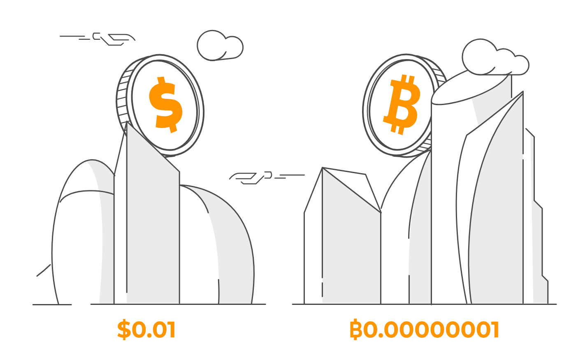
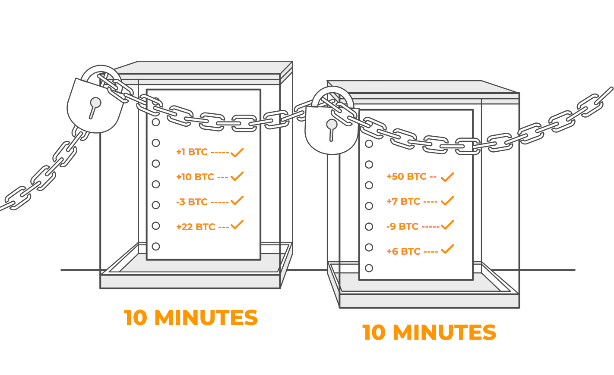

+++
title = 'Introduzione'
author = 'Mattia'
date = 2024-10-30
weight = 1
draft = false
+++

> [!important] Brief:
> Questo articolo ti aiuterà a capire cos'è bitcoin, perché è stato sviluppato e a familiarizzare con le basi del suo funzionamento.

### Perchè è stato creato Bitcoin

Nell'agosto 2008 è stato registrato il dominio [bitcoin.org](https://bitcoin.org/en/) e a novembre dello stesso anno una persona misteriosa, tutt'oggi sconosciuta, ha pubblicato il famoso [Bitcoin Whitepaper](src/bitcoin_it.pdf), firmato da [Satoshi Nakamoto](https://it.wikipedia.org/wiki/Satoshi_Nakamoto). I primi bitcoin sono stati emessi nel gennaio 2009.

Bitcoin è un sistema di pagamento elettronico che consente a chiunque di aprire un account e inviare qualsiasi somma di denaro direttamente a chiunque, ovunque nel mondo, senza bisogno di intermediari. Questo rende le transazioni più rapide, economiche e sicure per la privacy, poiché le informazioni personali non sono necessarie.

Bitcoin è stato creato come alternativa all'attuale sistema finanziario, nel quale poche grandi banche detengono il potere di decidere chi può aprire un conto e quali transazioni sono consentite. Questo centralizza il controllo sul denaro e ci obbliga a fidarci che le banche agiscano in modo equo e responsabile.

### Perchè Bitcoin è così rivoluzionario

- È una forma di denaro completamente digitale.
- Può essere utilizzato da chiunque, ovunque nel mondo.
- È una valuta universale.
- Consente transazioni rapide e a basso costo, disponibili 24 ore su 24.
- Non è controllato da alcuna persona, azienda o governo.
- Per utilizzarlo basta una connessione a Internet e un telefono o un computer.

Bitcoin non è controllato da nessuna persona, azienda o governo. Diversamente dai pagamenti tradizionali che passano attraverso le banche, i bitcoin vengono inviati direttamente da una persona all’altra in un sistema _peer-to-peer (P2P)_, ovvero senza un controllo centrale. Gli utenti di Bitcoin, sparsi in tutto il mondo, usano Internet per inviare e ricevere pagamenti, senza bisogno di conoscersi o fidarsi l’uno dell’altro per far funzionare il sistema. _Satoshi Nakamoto_ ha così reinventato il denaro e il modo di trasferirlo.

##### Vantaggio 1 - Decentralizzazione

- Il denaro tradizionale è controllato da banche e governi, quindi è _centralizzato_.
- Bitcoin non è regolato da alcuna singola entità, quindi è _decentralizzato_.
- Non avere banche coinvolte significa che nessuno può rifiutare le tue transazioni, chiudere il tuo conto o addebitarti commissioni eccessive. Le banche non hanno più potere decisionale e questo rende il denaro decentralizzato così potente.

##### Vantaggio 2 - Niente denaro contraffatto

- Le valute cartacee, le carte di credito e gli assegni possono essere falsificati.
- Bitcoin risolve il problema della doppia spesa, rendendo impossibile la contraffazione. Inoltre, non sono necessarie tariffe elevate per la protezione dalle frodi.

##### Vantaggio 3 - Fornitura limitata

- La moneta tradizionale viene creata dai governi in quantità illimitate, il che ne diminuisce il valore nel tempo.
- La fornitura di bitcoin è limitata a 21 milioni di monete. Questa scarsità è progettata per aumentarne il valore nel tempo.

Quando l'offerta di moneta aumenta continuamente, si genera un fenomeno chiamato _inflazione_, per cui il denaro perde valore ogni giorno. L’offerta limitata di Bitcoin crea invece l'effetto opposto, noto come _deflazione_, il che significa che il valore di ciascun Bitcoin tende ad aumentare nel tempo.

##### Vantaggio 4 - Divisibilità

- - Il denaro tradizionale può essere suddiviso fino a un solo centesimo (2 cifre decimali).
- I bitcoin possono essere spesi in unità molto più piccole, chiamate _Satoshi_ (fino a 8 cifre decimali).

Questa elevata divisibilità rende possibile utilizzare piccole porzioni di un bitcoin, adatte anche a microtransazioni che il denaro tradizionale non può gestire.

##### Vantaggio 5 - Sicurezza

Poiché Bitcoin rappresenta un notevole valore economico, è progettato per essere molto sicuro. Utilizza la _crittografia_ per inviare pagamenti in modo sicuro, ed è proprio questa sicurezza che gli ha dato il nome di _criptovaluta_. In termini semplici, la crittografia è una tecnologia che protegge le informazioni con complesse funzioni matematiche, salvaguardando il tuo account e permettendoti di inviare denaro in sicurezza.

### Come funziona Bitcoin

Immagina quattro sconosciuti seduti in una stanza, ciascuno con il proprio taccuino. Poiché sono estranei, non si conoscono né si fidano l’uno dell’altro.

I quattro sconosciuti rappresentano la comunità di utenti di Bitcoin. I taccuini rappresentano la _blockchain_, un registro pubblico che contiene ogni transazione bitcoin mai eseguita. Questo registro è digitale, accessibile a tutti e sincronizzato in tempo reale.

Quando uno sconosciuto trasferisce un bitcoin a un altro, tutti e quattro annotano la transazione e poi confrontano i taccuini per assicurarsi che corrispondano.

Ogni transazione viene registrata su tutte le copie della _blockchain_ in tutto il mondo. Se i taccuini corrispondono, la transazione viene approvata; in caso contrario, qualsiasi copia che non corrisponde viene ignorata. Questa sincronizzazione costante rende impossibile per i truffatori manipolare il sistema.

La _blockchain_ archivia permanentemente tutte le transazioni passate, rendendo possibile sapere sempre dove si trova ogni singolo bitcoin. Questo processo di verifica, chiamato **algoritmo di consenso**, è il meccanismo grazie al quale il sistema riconosce le transazioni valide.

### Come funzionano le transazioni

Come i soldi veri, i bitcoin sono custoditi nei portafogli, ma i portafogli di bitcoin sono digitali. In realtà, il portafoglio non contiene bitcoin, ma solo l'accesso ad essi, che sono registrati nella _blockchain_.

Ogni portafoglio ha un indirizzo pubblico, simile a un numero di conto bancario, che viene usato per inviare e ricevere bitcoin.

L'indirizzo pubblico del portafoglio bitcoin è come un numero di conto bancario: viene utilizzato per assicurarsi che il denaro venga inviato al portafoglio giusto.
**Tutto ciò che serve per ricevere denaro è il proprio l'indirizzo pubblico**, che è composto da una stringa di numeri e lettere, senza alcun riferimento ai propri dati personali.

Per inviare bitcoin, serve la _chiave privata_ del portafoglio, che funziona come una firma digitale e dimostra che sei autorizzato a trasferire i fondi. **È molto importante tenere la chiave privata sempre segreta**.

---

### Esempio pratico

Immagina che Mattia voglia inviare un bitcoin ad Alice. Mattia inserisce nel suo portafoglio l'indirizzo pubblico di Alice e usa la chiave privata per firmare la transazione.

Alice non deve fare nulla per ricevere il denaro e nessuna terza parte è necessaria per completare la transazione.

Dopo che Mattia ha premuto "Invia", la transazione viene annunciata e attende l’approvazione. La comunità di utenti verifica che Mattia abbia abbastanza bitcoin controllando le copie della blockchain.

Le transazioni recenti vengono raggruppate in un "blocco" ogni 10 minuti circa e aggiunte alla blockchain. I _minatori_ fanno questo lavoro in cambio di bitcoin appena creati, ed è così che nascono nuovi bitcoin.

Il mining continuerà fino al 2140, quando saranno stati creati tutti i 21 milioni di bitcoin. Da quel momento in poi, i minatori guadagneranno solo attraverso piccole commissioni sulle transazioni.

Bitcoin è rivoluzionario perché ti offre il pieno controllo sul tuo denaro e permette di scambiare valore in modo sicuro e senza terze parti.

