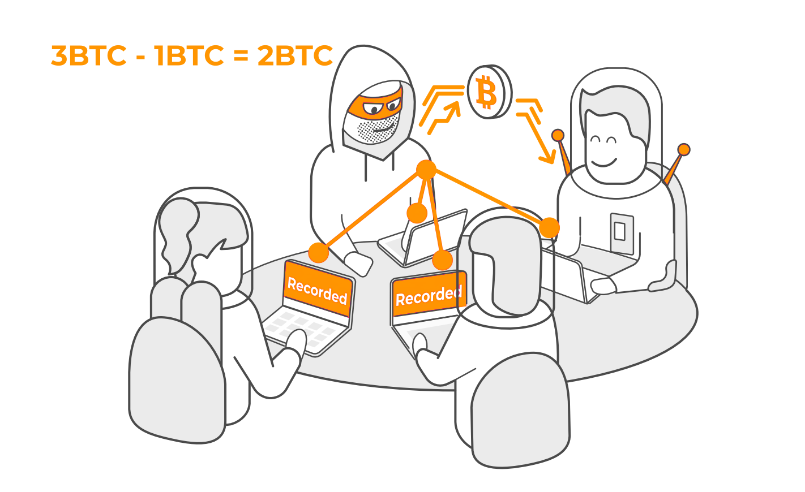
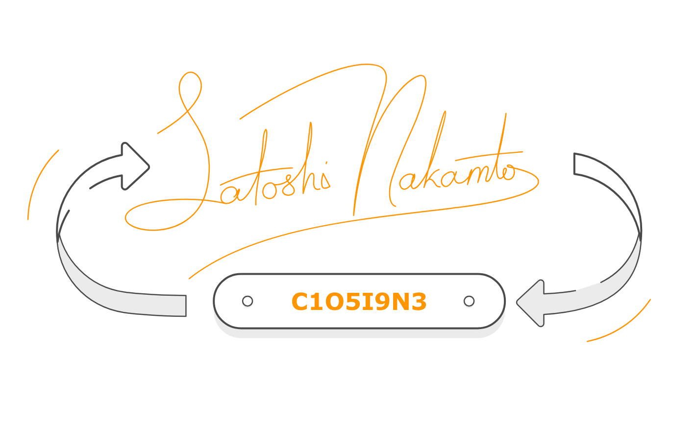
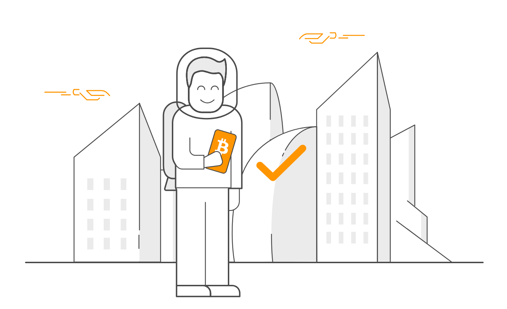
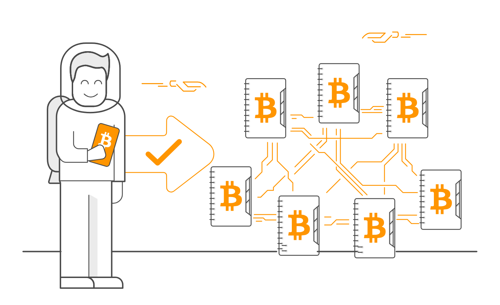

+++
title = 'Introduzione'
author = 'Mattia'
date = 2024-10-30
weight = 1
draft = false
+++

> [!important] Brief:
> Questo articolo ti offre un'introduzione a bitcoin, al perché è stato sviluppato e a familiarizzare con i principi del suo funzionamento:
> 
> Bitcoin è un software che consente di inviare e ricevere pagamenti digitali senza intermediari come banche, grazie a un registro condiviso chiamato blockchain. La blockchain è un registro che contiene tutte le transazioni che avvengono sulla rete Bitcoin, aggiornato ogni 10 minuti attraverso un processo chiamato mining, che previene il problema della doppia spesa.
> 
> Il mining non solo aggiunge nuove transazioni alla blockchain, ma genera anche nuovi Bitcoin come ricompensa per i miner. Le transazioni sono registrate come messaggi digitali, firmati con una chiave privata per garantirne la sicurezza. Possedere Bitcoin significa controllare la chiave privata associata a un indirizzo sulla blockchain, e per farlo, gli utenti utilizzano portafogli digitali sicuri.
> 
> In breve, Bitcoin offre un sistema decentralizzato di scambi digitali, protetto dalla potenza combinata di tutti i miner e dalla sicurezza della blockchain, che registra ogni transazione effettuata.

Il mining non solo aggiunge nuove transazioni alla blockchain, ma genera anche nuovi Bitcoin come ricompensa per i miner. Le transazioni sono registrate come messaggi digitali, firmati con una chiave privata per garantirne la sicurezza. Possedere Bitcoin significa controllare la chiave privata associata a un indirizzo sulla blockchain, e per farlo, gli utenti utilizzano portafogli digitali sicuri.

In breve, Bitcoin offre un sistema decentralizzato di scambi digitali, protetto dalla potenza combinata di tutti i miner e dalla sicurezza della blockchain, che registra ogni transazione effettuata.

### Che cos'è Bitcoin e perché è stato creato

Bitcoin è un sistema di pagamento elettronico che permette a chiunque di inviare denaro direttamente a un'altra persona, ovunque nel mondo, senza bisogno di intermediari. Questo sistema si basa su un software _open-source_ che puoi scaricare ed eseguire sul tuo computer. Quando avvii Bitcoin, il programma si connette a una rete di computer distribuita, mantenendo sincronizzato un file speciale chiamato **blockchain**. La blockchain è un registro pubblico che contiene tutte le transazioni mai effettuate con Bitcoin.

Bitcoin è stato creato per affrontare le limitazioni del sistema finanziario tradizionale, dove le banche hanno il controllo su chi può accedere ai conti, quali transazioni sono consentite e quanto costano. Questa centralizzazione ci obbliga a fidarci delle istituzioni finanziarie, che non sempre agiscono in modo equo. Bitcoin decentralizza il controllo del denaro, offrendo un'alternativa rivoluzionaria per trasferire valore in modo rapido, economico e sicuro, senza compromettere la privacy.

La siua nascita risale al 2008, quando un individuo o un gruppo anonimo, noto come [Satoshi Nakamoto](https://it.wikipedia.org/wiki/Satoshi_Nakamoto), ha pubblicato il famoso [Bitcoin Whitepaper](src/bitcoin_it.pdf). I primi bitcoin sono stati emessi nel gennaio 2009, segnando l'inizio di una nuova era per il denaro digitale.

### I vantaggi rivoluzionari di Bitcoin
##### Vantaggio 1 - Decentralizzazione

- Il denaro tradizionale è controllato da banche e governi, quindi è _centralizzato_.
- Bitcoin non è regolato da alcuna singola entità, quindi è _decentralizzato_.
- Non avere banche coinvolte significa che nessuno può rifiutare le tue transazioni, chiudere il tuo conto o addebitarti commissioni eccessive. Le banche non hanno più potere decisionale e questo rende il denaro decentralizzato così potente.

##### Vantaggio 2 - Niente denaro contraffatto

- Le valute cartacee, le carte di credito e gli assegni possono essere falsificati.
- Bitcoin risolve il problema della doppia spesa, rendendo impossibile la contraffazione. Inoltre, non sono necessarie tariffe elevate per la protezione dalle frodi.

##### Vantaggio 3 - Fornitura limitata

- La moneta tradizionale viene creata dai governi in quantità illimitate, il che ne diminuisce il valore nel tempo.
- La fornitura di bitcoin è limitata a 21 milioni di monete. Questa scarsità è progettata per aumentarne il valore nel tempo.

Quando l'offerta di moneta aumenta continuamente, si genera un fenomeno chiamato _inflazione_, per cui il denaro perde valore ogni giorno. L’offerta limitata di Bitcoin crea invece l'effetto opposto, noto come _deflazione_, il che significa che il valore di ciascun Bitcoin tende ad aumentare nel tempo.

##### Vantaggio 4 - Divisibilità

- - Il denaro tradizionale può essere suddiviso fino a un solo centesimo (2 cifre decimali).
- I bitcoin possono essere spesi in unità molto più piccole, chiamate _Satoshi_ (fino a 8 cifre decimali).

Questa elevata divisibilità rende possibile utilizzare piccole porzioni di un bitcoin, adatte anche a microtransazioni che il denaro tradizionale non può gestire.

##### Vantaggio 5 - Sicurezza

Poiché Bitcoin rappresenta un notevole valore economico, è progettato per essere molto sicuro. Utilizza la _crittografia_ per inviare pagamenti in modo sicuro, ed è proprio questa sicurezza che gli ha dato il nome di _criptovaluta_. In termini semplici, la crittografia è una tecnologia che protegge le informazioni con complesse funzioni matematiche, salvaguardando il tuo account e permettendoti di inviare denaro in sicurezza.

### Come funziona Bitcoin

Bitcoin è basato su una rete _peer-to-peer_ (P2P), dove ogni partecipante è un nodo indipendente. Ogni volta che viene creata una nuova transazione, questa viene distribuita a tutti i nodi della rete. Circa ogni 10 minuti, un nodo selezionato aggiorna la blockchain aggiungendo un nuovo blocco di transazioni. Questo processo è noto come **mining**.

Il mining è una competizione tra i nodi per calcolare un valore speciale, chiamato **hash**, che consente di aggiungere un nuovo blocco alla blockchain. Questo calcolo richiede un'enorme potenza computazionale, ma garantisce che nessun singolo nodo possa controllare la rete. Come ricompensa per il loro lavoro, i miner ricevono nuovi bitcoin, che sono distribuiti attraverso questo processo.

La blockchain è progettata per essere immutabile: ogni blocco è collegato al precedente attraverso il suo hash. Questo rende praticamente impossibile modificare transazioni già registrate senza ricostruire l'intera catena, un'impresa che richiederebbe più potenza di calcolo di quella disponibile nella rete.

### Come si possiedono e si utilizzano i bitcoin

I bitcoin non esistono come oggetti fisici o file digitali. Invece, ciò che possiedi è una **chiave privata** che ti consente di accedere a un certo ammontare di bitcoin registrati sulla blockchain. La chiave privata è essenziale per firmare digitalmente le transazioni e trasferire fondi. Per proteggere le chiavi private, gli utenti utilizzano portafogli digitali, che possono essere hardware o software.

Ogni portafoglio ha anche un **indirizzo pubblico**, simile a un numero di conto bancario, che può essere condiviso con altri per ricevere pagamenti. Le transazioni in Bitcoin non richiedono dati personali, garantendo un alto livello di privacy per gli utenti.

### Perché Bitcoin è rivoluzionario

Bitcoin risolve il problema della **doppia spesa**, che aveva ostacolato i tentativi precedenti di creare valute digitali. Grazie alla blockchain e al mining, Bitcoin garantisce che ogni unità della valuta possa essere spesa una sola volta, eliminando la necessità di una banca centrale.

Inoltre, la sua natura distribuita e senza confini lo rende accessibile a chiunque disponga di una connessione Internet, offrendo un'alternativa universale e inclusiva ai sistemi finanziari tradizionali.

Bitcoin non è solo una tecnologia, ma un cambiamento radicale nel modo in cui concepiamo il denaro e il trasferimento di valore. Offre una rete sicura, trasparente e decentralizzata che elimina la necessità di intermediari, proteggendo la privacy e riducendo i costi. Con il suo design innovativo e la sua scarsità programmata, Bitcoin si è affermato come una delle innovazioni più significative del nostro tempo.

### Vediamolo all'opera
Immagina quattro sconosciuti seduti in una stanza, ciascuno con il proprio taccuino. Poiché sono estranei, non si conoscono né si fidano l’uno dell’altro.

I quattro sconosciuti rappresentano la comunità di utenti di Bitcoin. I taccuini rappresentano la _blockchain_, un registro pubblico che contiene ogni transazione bitcoin mai eseguita. Questo registro è digitale, accessibile a tutti e sincronizzato in tempo reale.

Quando uno sconosciuto trasferisce un bitcoin a un altro, tutti e quattro annotano la transazione e poi confrontano i taccuini per assicurarsi che corrispondano.

Ogni transazione viene registrata su tutte le copie della _blockchain_ in tutto il mondo. Se i taccuini corrispondono, la transazione viene approvata; in caso contrario, qualsiasi copia che non corrisponde viene ignorata. Questa sincronizzazione costante rende impossibile per i truffatori manipolare il sistema.

La _blockchain_ archivia permanentemente tutte le transazioni passate, rendendo possibile sapere sempre dove si trova ogni singolo bitcoin. Questo processo di verifica, chiamato **algoritmo di consenso**, è il meccanismo grazie al quale il sistema riconosce le transazioni valide.

### Come funzionano le transazioni

Come i soldi veri, i bitcoin sono custoditi nei portafogli, ma i portafogli di bitcoin sono digitali. In realtà, il portafoglio non contiene bitcoin, ma solo l'accesso ad essi, che sono registrati nella _blockchain_.

Ogni portafoglio ha un indirizzo pubblico, simile a un numero di conto bancario, che viene usato per inviare e ricevere bitcoin.

L'indirizzo pubblico del portafoglio bitcoin è come un numero di conto bancario: viene utilizzato per assicurarsi che il denaro venga inviato al portafoglio giusto.
**Tutto ciò che serve per ricevere denaro è il proprio l'indirizzo pubblico**, che è composto da una stringa di numeri e lettere, senza alcun riferimento ai propri dati personali.

Per inviare bitcoin, serve la _chiave privata_ del portafoglio, che funziona come una firma digitale e dimostra che sei autorizzato a trasferire i fondi. **È molto importante tenere la chiave privata sempre segreta**.

---

### Esempio pratico

Immagina che Mattia voglia inviare un bitcoin ad Alice. Mattia inserisce nel suo portafoglio l'indirizzo pubblico di Alice e usa la chiave privata per firmare la transazione.

Alice non deve fare nulla per ricevere il denaro e nessuna terza parte è necessaria per completare la transazione.

Dopo che Mattia ha premuto "Invia", la transazione viene annunciata e attende l’approvazione. La comunità di utenti verifica che Mattia abbia abbastanza bitcoin controllando le copie della blockchain.

Le transazioni recenti vengono raggruppate in un "blocco" ogni 10 minuti circa e aggiunte alla blockchain. I _minatori_ fanno questo lavoro in cambio di bitcoin appena creati, ed è così che nascono nuovi bitcoin.

Il mining continuerà fino al 2140, quando saranno stati creati tutti i 21 milioni di bitcoin. Da quel momento in poi, i minatori guadagneranno solo attraverso piccole commissioni sulle transazioni.

Bitcoin è rivoluzionario perché ti offre il pieno controllo sul tuo denaro e permette di scambiare valore in modo sicuro e senza terze parti.

