+++
title = 'Creare il proprio nodo'
author = 'me'
date = 2024-10-05
weight = 5
draft = false
+++

> [!important] Brief:
> Questa sezione ti guiderà nella preparazione di un nodo bitcoin personale e a familiarizzare con le basi del suo funzionamento.

### Perchè possedere un nodo privato

Operare con Bitcoin tramite un nodo privato ti permette di avere il pieno controllo delle tue transazioni e dei tuoi fondi, proteggendo la tua privacy in modo più efficace rispetto all'uso di servizi di terze parti. Con un nodo privato, non dipendi da intermediari per verificare le transazioni, evitando che i tuoi dati personali vengano tracciati o esposti. Inoltre, contribuisci alla sicurezza e alla decentralizzazione della rete Bitcoin, senza affidarti a piattaforme che potrebbero monitorare o censurare le tue attività. In sintesi, un nodo privato ti offre maggiore autonomia, sicurezza e privacy.

# Hardware necessario

Acquistare un mini PC per creare il proprio nodo Bitcoin è una scelta vantaggiosa poichè sono compatti, silenziosi e richiedono poca energia, il che li rende ideali per un funzionamento continuo senza incidere troppo sui consumi elettrici.

Sono qui proposte due soluzioni, che ho personalmente provato e che mi sento di consigliare:


{}
### Acemagic S1 N95
Facilmente reperibile su Amazon o sul [sito del produttore](https://acemagic.eu/products/s1-minipc). Si consiglia l'acquisto separato di un SSD NVMe PCIe3.0 da almeno 2TB, che sarà poi da installare all'interno del mini PC.

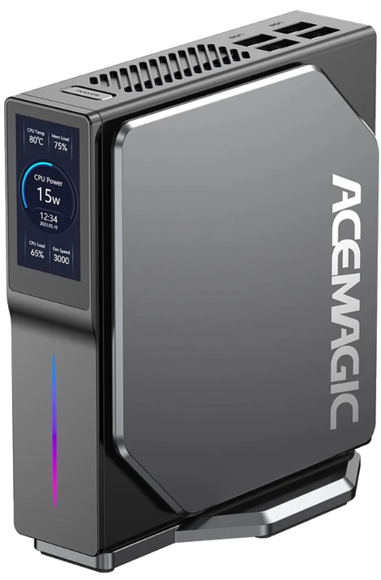

| CPU   | Intel Alder Lake N95 - 1.7GHz            |
| ----- | ---------------------------------------- |
| RAM   | 16GB DDR4                                |
| SSD   | 1 slot M.2 NVMe PCIe3.0, 1 slot M.2 SATA |
| Power | DC 12V 4A - 48W                          |
{}

{}
### HP EliteDesk 800 G3
Dispositivi ricondizionati sono facilmente reperibili online (Amazon ed Ebay). Si consiglia l'acquisto separato di un SSD NVMe PCIe3.0 da almeno 2TB, che sarà poi da installare all'interno del mini PC.

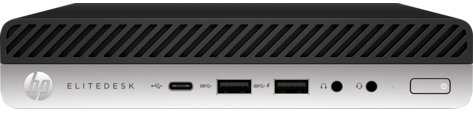

| CPU   | Intel Core i5 gen6 - 2.4GHz                          |
| ----- | ---------------------------------------------------- |
| RAM   | 16GB DDR4                                            |
| SSD   | 1 slot SATA III 2.5'' 6GB/s, 1 slot M.2 NVMe PCIe3.0 |
| Power | DC 19.5V 3.33A - 65W                                 |
{}


---

# Installazione StartOS

### Scaricare StartOS

1) Cliccare su questo [link](https://github.com/Start9Labs/start-os/releases/)

2) Clicca sull'ultima release, taggata come "Latest"

	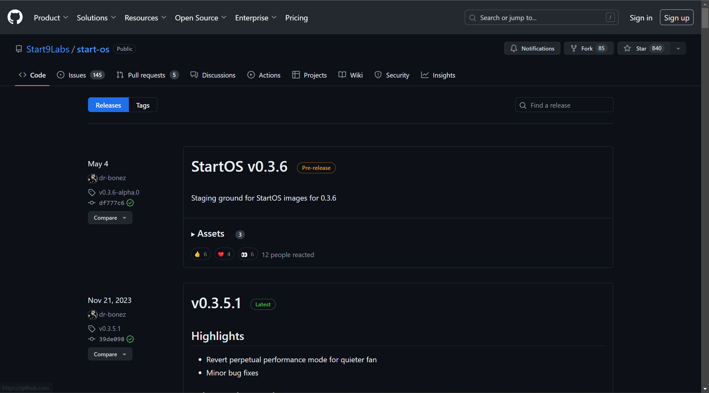

3) Scorrere in fondo alla pagina e cliccare sul file che termina con "x86_64.iso"

	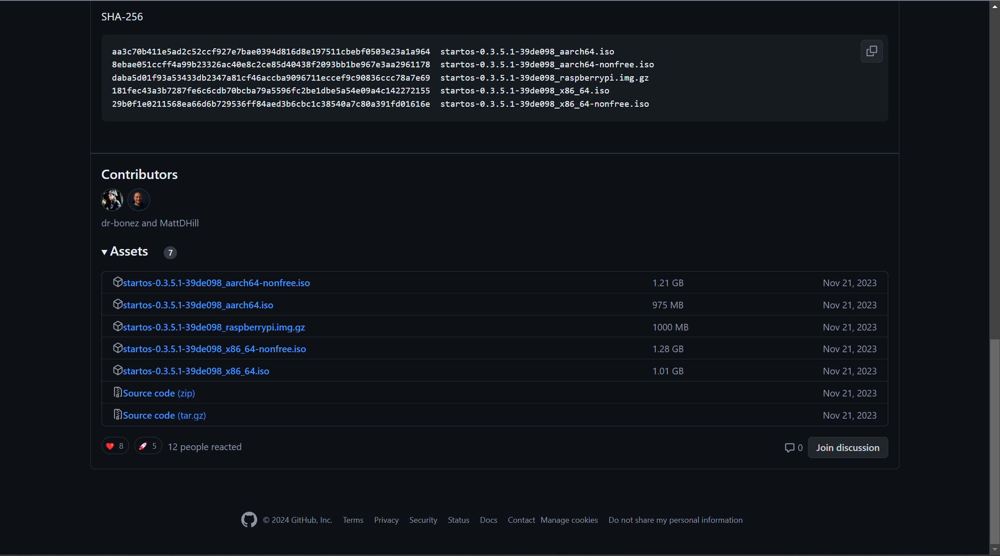

### Creare una ISO di StartOS per il boot

4) Scaricare [Balena Hetcher](https://etcher.balena.io/#download-etcher)

5) Scorrere lungo la pagina e cliccare sul file relativo al proprio sistema operativo (il sistema operativo che si usa abitualmente sul proprio PC, __non__ il sistema operativo del full node)

6) Collegare una chiavetta USB al proprio PC

7) Avviare Balena Hetcher

	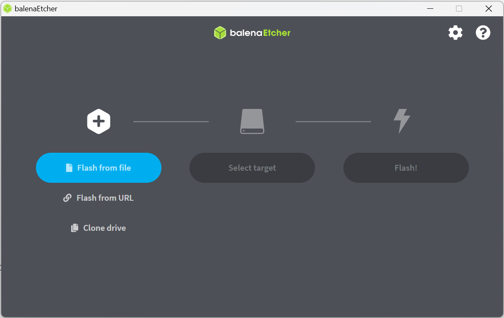

8) Cliccare su "Flash from file" e selezionare il file di StartOS (con estensione .iso) scaricato precedentemente

9) Cliccare su "Select target" e selezionare la chiavetta USB (precedentemente collegata al PC)

10) Cliccare su "Flash!" e attendere il completamento


### Installare StartOS sul Nodo

11) Collegare monitor, tastiera, mouse e alimentazione al Nodo ed infine, collagare la chiavetta USB con la ISO di StartOS per il boot

12) Accendere il Nodo e, mentre si avvia (fin dai primi istanti dopo averlo acceso) premere ripetutamente il tasto <kbd>ESC</kbd> (o il tasto <kbd>F4</kbd>, o <kbd>F8</kbd>, in funzione dell'hardware utilizzato), fino a quando comparirà la schermata del BIOS

	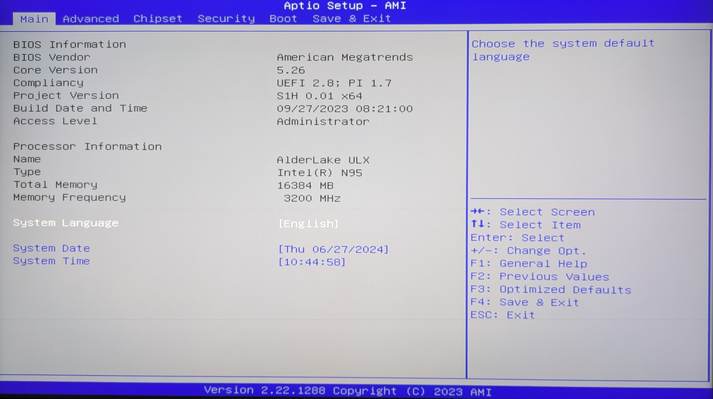

13)  Utilizzando i tasti freccia della tastiera, selezionare la scheda "Boot" e scorrere fino alla voce "Boot Option #1", quindi premere <kbd>INVIO</kbd> e selezionare la chiavetta USB inserita

14) Selezionare la scheda "Save & Exit", scorrere su "Save Changes and Exit" e premere <kbd>INVIO</kbd>

15) Attendere il riavvio e l'inizializzazione dell'installazione di StartOS, quindi selezionare l'SSD su cui effettuare l'installazione

	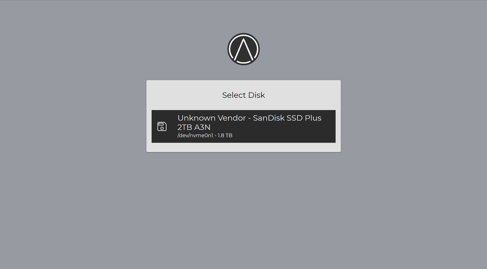

16) Cliccare su "Install StartOS" e confermare cliccando CONTINUE

	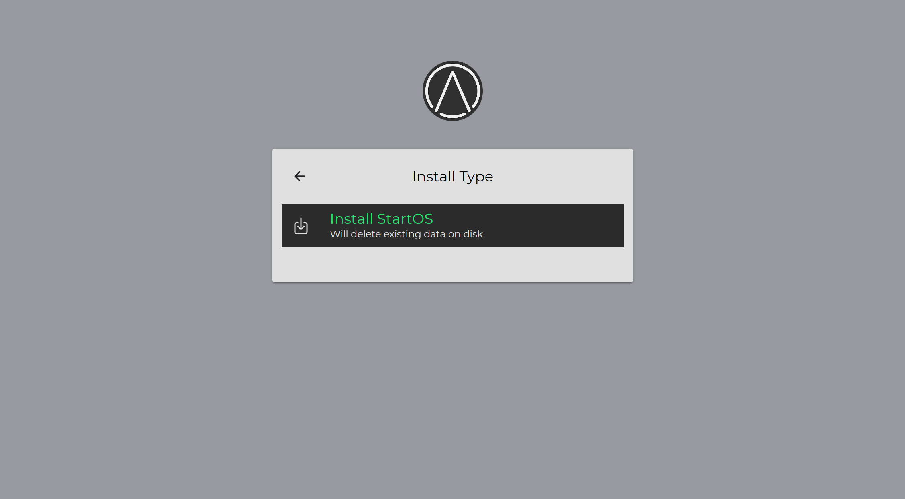
	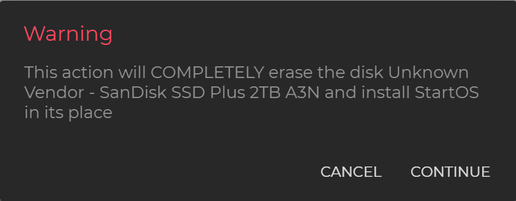

17) Attendere il completamento dell'installazione, quindi rimuovere la chiavetta USB dal Nodo e cliccare su REBOOT

	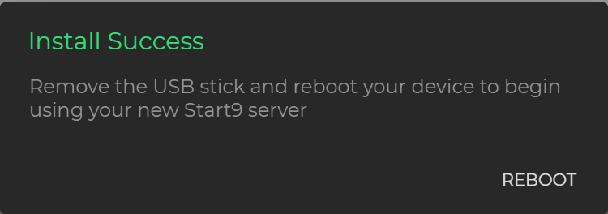

18) Se tutto è andato a buon fine, comparirà questa schermata. Cliccare su "Start Fresh" e quindi selezionare l'SSD 

	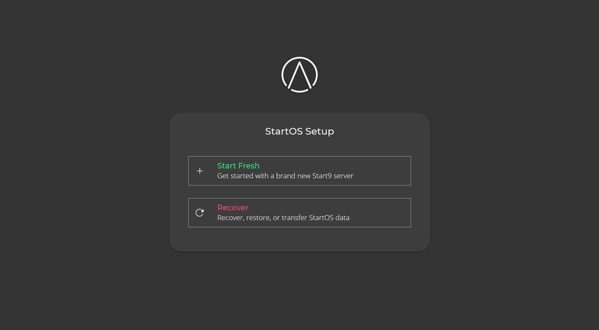
	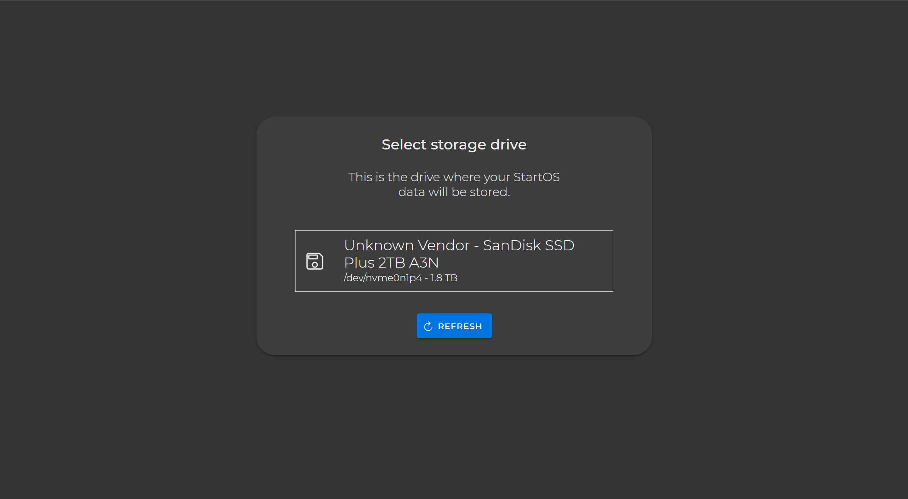

19) Inserire una password, ri-scriverla per conferma e quindi cliccare su FINISH.

	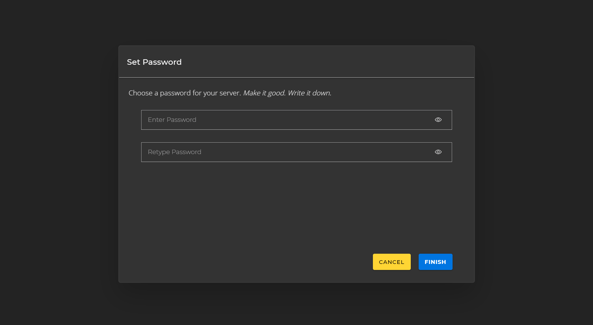

20) Attendere l'inizializzazione di StartOS

	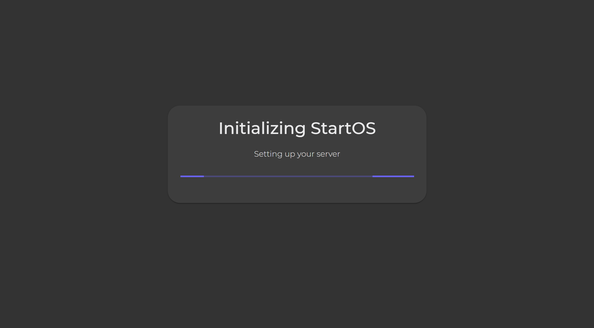

21) Al termine dell'inizializzazione, sarà possibile loggarsi per accedere al proprio nodo

	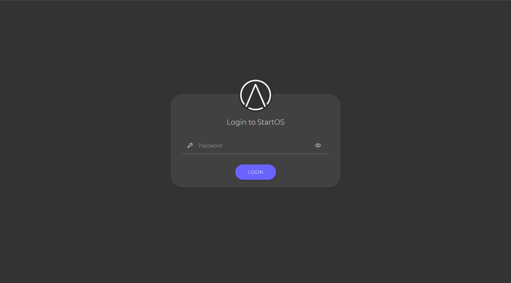
	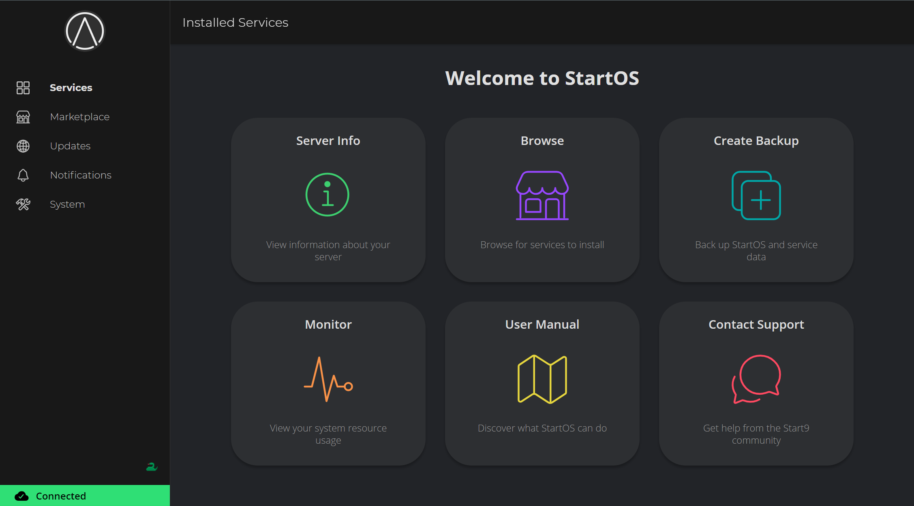


---

# Configurazione StartOS

### Accesso a StartOS da rete LAN

Per poter accedere al nodo tramite un altro PC collegato alla stessa rete del nodo (per esempio tramite la propria WiFi di casa o di ufficio) è necessario conoscere l'IP del nodo.

22) Dal menù di sinistra, cliccare su "System"

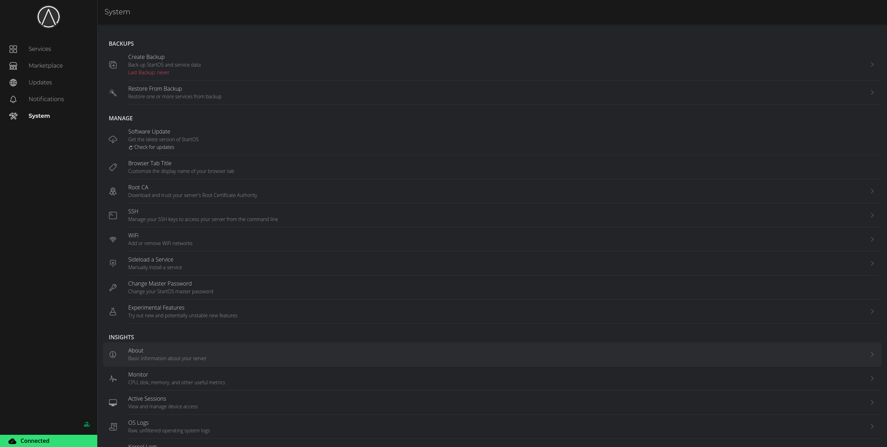

23) Poi cliccare su "About"

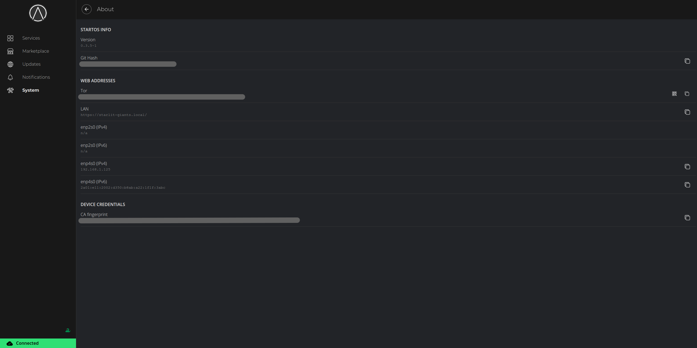

24) Copiare l'indirizzo IP che si trova alla voce "enp4s0 (IPv4)" ed inserirlo come URL nel brower di un qualunque PC collegato alla stessa rete del nodo.
### Installazione del certificato

Provando ad accedere come descritto al paragrafo precedente, si noterà che la connessione non è sicura. Questo perchè bisogna installare il certificato per poter sfruttare la connessione sicura https anzichè http.

25) Dal menù di sinistra, cliccare su "System"

	

26) Poi cliccare su "Root CA" e quindi su "Download Root CA"

27) L'installazione del certificato dipende dal sistema operativo del PC da cui si vuole accedere al nodo:
	1) Se ci si trova su sistema operativo Windows, seguire questa [guida](https://docs.start9.com/0.3.5.x/device-guides/windows/ca-windows#ca-windows)
	2) Se ci si trova su sistema operativo Linux, seguire questa [guida](https://docs.start9.com/0.3.5.x/device-guides/linux/ca-linux#ca-linux)
	3) Se ci si trova su sistema operativo Mac, seguire questa [guida](https://docs.start9.com/0.3.5.x/device-guides/mac/ca-mac#ca-mac)
	4) Se ci si trova su sistema operativo Android, seguire questa [guida](https://docs.start9.com/0.3.5.x/device-guides/android/ca-android#ca-android)
	5) Se ci si trova su sistema operativo iOS, seguire questa [guida](https://docs.start9.com/0.3.5.x/device-guides/ios/ca-ios#ca-ios)

### Predisposizione accesso con SSH (OPZIONALE)

L'accesso al nodo tramite protocollo SSH è **OPZIONALE**, ma si rivela particolarmente utile in fase di manutenzione; nel caso in cui fosse necessario accedere al nodo per effettuare azioni di diagnostica, interventi correttivi o di ripristino.

28) Per configurare l'accesso tramite SSH, seguire questa [guida](https://docs.start9.com/0.3.5.x/user-manual/ssh), in particolare, seguire i paragrafi "Creating an SSH Key" e "Registering an SSH Key"

### Installazione di Bitcoin Core

**Bitcoin Core** è il software open-source principale per interagire con la rete Bitcoin. Il software implementa il protocollo Bitcoin e include tutte le funzionalità necessarie per partecipare alla rete. L'installazione potrà richiedere anche diversi giorni, poichè la prima volta sarà scaricata l'intera blockchain.

29) Dal menù di sinistra, cliccare su "Marketplace" e poi cercare "Bitcoin Core" nella barra di "Search". Quindi, cliccare sull'app "Bitcoin Core" e seguire le semplici informazioni a video per l'installazione.

### Installazione di Electrs

**Electrs** è un software open-source progettato per migliorare l'accesso ai dati della blockchain Bitcoin tramite il protocollo **Electrum**, un protocollo leggero per interrogare i nodi Bitcoin. Con Electrs, è possibile collegare e gestire tutti i tuoi Wallets; inoltre, si ha la certezza che le richieste di transazioni e bilanci vengono elaborate dal tuo nodo, proteggendo la tua privacy e impedendo a terzi di monitorare le tue attività. L'installazione potrà richiedere anche diversi giorni, poichè la prima volta sarà indicizzata tutta la blockchain.

30) Dal menù di sinistra, cliccare su "Marketplace" e poi cercare "Electrs" nella barra di "Search". Quindi, cliccare sull'app "Electrs" e seguire le semplici informazioni a video per l'installazione.

### Installazione di Mempool

**Mempool** è uno strumento open-source che offre una visualizzazione in tempo reale dello stato della mempool di Bitcoin e altre informazioni sulla rete. È un esploratore blockchain, progettato per fornire un modo intuitivo e visivamente accattivante per monitorare le transazioni, i blocchi, e l'attività della rete Bitcoin. L'installazione locale offre il massimo livello di privacy, poiché i dati vengono direttamente dal proprio nodo senza bisogno di accedere a server di terze parti.

31) Dal menù di sinistra, cliccare su "Marketplace" e poi cercare "Mempool" nella barra di "Search". Quindi, cliccare sull'app "Mempool" e seguire le semplici informazioni a video per l'installazione.


---

# Utilizzo del Wallet con il proprio Nodo

### Installazione Sparrow Wallet

### Configurazione Sparrow Wallet

### Creazione/Importazione Wallet

### Collegamento del Ledger a Sparrow Wallet

Se ci troviamo in ambiente Linux Mint 22, per poter collegare con successo il Ledger Nano S Plus a Sparrow Wallet è necessario installare dei componenti che non sono inclusi di default nel sistema operativo.
Aprire il terminale (CTRL+ALT+T) ed inserire i seguenti comandi:

```bash
wget -q -O - https://raw.githubusercontent.com/LedgerHQ/udev-rules/master/add_udev_rules.sh | sudo bash
```
```bash
sudo add-apt-repository universe
```
```bash
sudo apt install libfuse2
```
### Transare tramite il proprio nodo