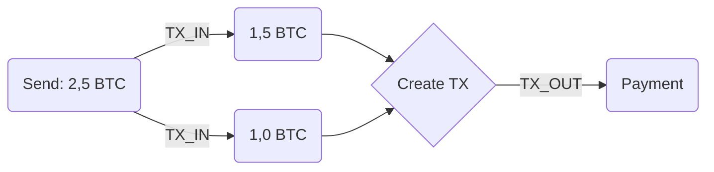
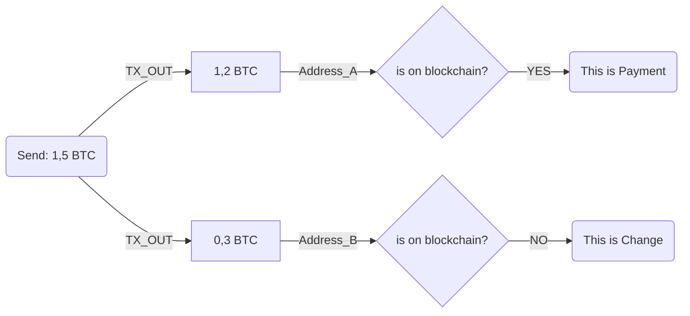
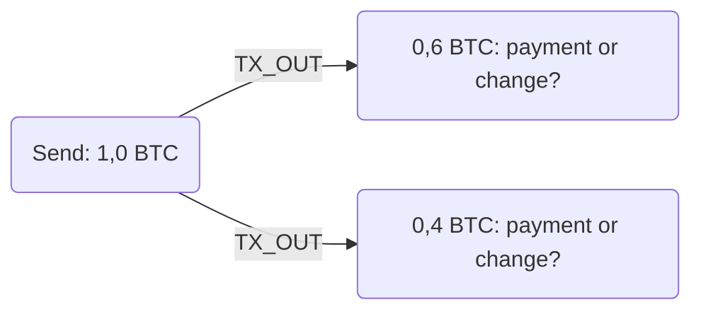
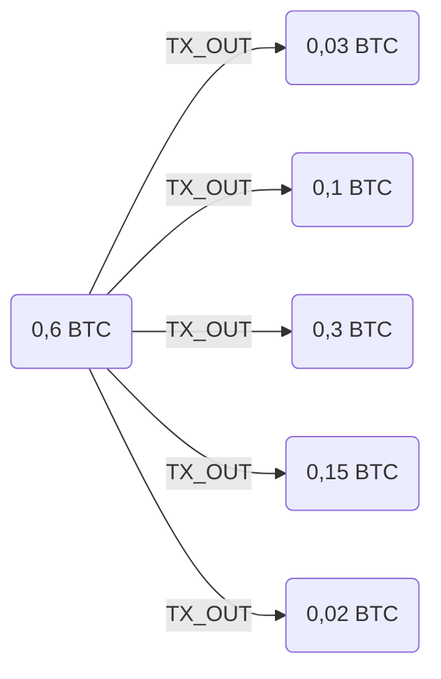
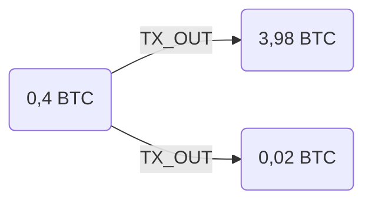
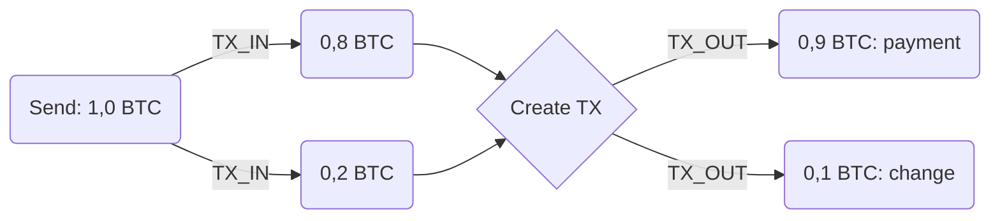

+++
title = 'Privacy e UTXO'
author = 'Mattia'
date = 2025-01-13
weight = 6
draft = false
+++

### Privacy e UTXO: come proteggere i tuoi Bitcoin

Quando si parla di privacy in Bitcoin, il concetto di **UTXO (Unspent Transaction Output)** riveste un ruolo fondamentale. Gli UTXO sono l’output di transazioni precedenti che non sono ancora stati spesi e rappresentano, di fatto, i tuoi Bitcoin disponibili per future transazioni.

### UTXO e trasparenza della rete

Gli UTXO non sono conservati privatamente all’interno del tuo portafoglio. Ogni nodo completo della rete Bitcoin mantiene una copia del set UTXO, cioè un elenco che include tutti i Bitcoin disponibili per la spesa. Quando utilizzi uno o più UTXO per effettuare un pagamento, questi appaiono come input della nuova transazione, che viene poi registrata in modo permanente e pubblico nella blockchain.

Questo meccanismo rende possibile tracciare gli UTXO e seguire il loro percorso attraverso diverse transazioni. Tuttavia, la tua privacy dipende dal fatto che gli indirizzi Bitcoin sono pseudonimi: non rivelano direttamente l’identità del proprietario.

### Le vulnerabilità della privacy

Il livello di privacy offerto da Bitcoin è, però, molto fragile. Esistono euristiche che consentono a terzi di dedurre informazioni personali analizzando il comportamento delle transazioni. Vediamo alcune delle più comuni.

#### Euristica 1: Tutti gli input di una transazione appartengono allo stesso portafoglio

Quando una transazione utilizza più input, spesso si presume che provengano dallo stesso portafoglio e che siano destinati ad un'unica entità. Questo è particolarmente vero se gli input combinati servono a coprire un pagamento di importo maggiore rispetto a ciascun input preso singolarmente.

**Ad esempio**:

Supponiamo che Mattia effettui un pagamento di 2,5 BTC, ma possieda due UTXO di 1,5 BTC e 1 BTC rispettivamente. In questo caso, il wallet combinerà i due input per coprire l'importo necessario.

**Rischio**: Dal punto di vista di un intercettatore:

- Se Mattia effettua un pagamento di 2,5 BTC usando due input, si può dedurre che entrambi gli input appartengano al suo portafoglio.

- Analizzando le transazioni precedenti che hanno generato quegli UTXO, si potrebbe scoprire che uno degli indirizzi è associato, per esempio, ad un noto servizio freelance, deducendo così che Mattia ha lavorato per quel servizio.

**Accorgimenti**: Per mitigare questa vulnerabilità:

1. Limita l'utilizzo di più input nella stessa transazione, quando possibile.

2. Utilizza un wallet che consenta di controllare manualmente quali input includere in una transazione (coin control).

3. Dividi preventivamente gli UTXO in importi che corrispondano a pagamenti comuni, così da evitare la necessità di combinare input.

#### Euristica 2: I resti sono di proprietà di nuovi indirizzi

Quando si effettua una transazione di importo totale superiore rispetto all'importo da pagare, viene assegnato un indirizzo, che torna sotto il controllo del mittente, contenente il resto. La maggior parte dei wallet moderni genera automaticamente un nuovo indirizzo per conservare il resto, separandolo dall'indirizzo di origine.

**Ad esempio**:

Supponiamo che Alice invii una transazione di 1,2 BTC per acquistare un servizio, utilizzando un UTXO da 1,5 BTC. La transazione genererà due output: uno per il pagamento di 1,2 BTC al destinatario e uno da 0,3 BTC, che rappresenta il resto. La maggior parte dei moderni wallet Bitcoin crea un nuovo indirizzo per conservare questo resto.

**Rischio**: Dal punto di vista di un intercettatore:

- Se uno degli output di una transazione è un indirizzo mai visto prima sulla blockchain, è probabile che si tratti del resto.

- Questo indirizzo "nuovo" può essere monitorato per tracciare successivamente altre transazioni effettuate da Alice, rivelando ulteriori dettagli sulle sue finanze.

**Accorgimenti**: Per mitigare questa vulnerabilità:

1. Configura il tuo wallet per utilizzare indirizzi già esistenti per i resti, ove possibile, invece di crearne di nuovi.

2. Effettua periodicamente transazioni di consolidamento, spostando i resti in un unico UTXO senza collegarli direttamente a una transazione specifica.

#### Euristica 3: Le transazioni dei portafogli dei consumatori hanno non più di due output

Quando un consumatore effettua una transazione di importo totale superiore rispetto all'importo da pagare, si produrrà un indirizzo contenente il pagamento ed un altro indirizzo contenente il resto. Ma come si può distinguere l'uno dall'altro?

**Ad esempio**:

Supponiamo che Mattia invii una transazione di 0,6 BTC per acquistare un servizio, utilizzando un UTXO da 1,0 BTC. La transazione genererà due output: uno per il pagamento di 0,6 BTC al destinatario e uno da 0,4 BTC, che rappresenta il resto. Per un osservatore esterno, a questo punto, è difficile dedurre quale sia il pagamento e quale sia il resto.

**Rischio**: Dal punto di vista di un intercettatore:

- Analizzando le transazioni successive di questi due output, si può dedurre che, se uno degli output (0,6 BTC) viene usato in una transazione futura con molti output, è probabile che rappresenti il pagamento. Questo perchè una società, rispetto ad un singolo individuo, è solita effettuare transazioni complesse.

- L’altro output (0,4 BTC), che sarà utilizzato in una transazione con due output, può essere identificato come il resto appartenente a Mattia. Questo perchè un individuo, rispetto ad una società, è solito effettuare transazioni semplici.

- Seguendo quest’ultimo indirizzo, l’intercettatore può ottenere ulteriori informazioni sulle finanze di Mattia.

**Accorgimenti**: Per mitigare questa vulnerabilità:

1. Esegui transazioni con più output significativi, rendendo più difficile distinguere tra pagamento e resto.

2. Utilizza un wallet che offra opzioni avanzate per selezionare manualmente gli input da includere nelle transazioni.

#### Euristica 4: i wallet evitano di spendere output non necessari

Quando si effettua una transazione con più input, se c'è un unico output della transazione con un valore inferiore a uno qualsiasi degli input, allora questo è il resto.

**Ad esempio**:

Supponiamo che Alice invii una transazione con due input, uno da 0,8 BTC e l'altro da 0,2 BTC. Il wallet combinerà i due input per effettuare il pagamento e la transazione produrrà due output, uno da 0,9 BTC e l'altro da 0,1 BTC.

**Rischio**: Dal punto di vista di un intercettatore:

- Osservando che uno degli output (0,1 BTC) ha un valore inferiore a entrambi gli input utilizzati (0,8 BTC e 0,2 BTC), si può dedurre che si tratta del resto. In caso contrario, vorrebbe dire che il wallet avrebbe speso un UTXO non necessario.

- Questo comportamento dei wallet, che evita di spendere UTXO non necessari, consente di identificare con maggiore certezza quale output appartiene ancora al mittente.

- Questo indirizzo, una volta identificato, può essere seguito per ulteriori analisi sulle finanze di Alice.

**Accorgimenti**: Per mitigare questa vulnerabilità:

1. Suddividi i tuoi UTXO in importi standard (ad esempio 1 BTC, 0,5 BTC) prima di effettuare pagamenti, così da ridurre la necessità di combinare input.

2. Utilizza un wallet che permetta di aggregare i resti in transazioni distinte e non immediatamente successive.

### Conclusioni

La privacy nella rete Bitcoin non è garantita automaticamente. Comprendere come funzionano gli UTXO e come vengono analizzati è essenziale per proteggere le tue informazioni personali. Ogni transazione che effettui lascia una traccia indelebile nella blockchain, e chiunque abbia le competenze e gli strumenti giusti può tentare di ricostruire la tua attività finanziaria.

Adottare le strategie giuste non significa solo proteggere la tua privacy, ma anche mantenere il controllo sui tuoi fondi e la tua sicurezza. È importante ricordare che il design trasparente di Bitcoin è sia una forza che una debolezza: se da un lato garantisce l'integrità del sistema, dall'altro richiede agli utenti una maggiore consapevolezza e responsabilità.

Investire nella tua privacy non è solo una questione di tutela personale, ma anche un modo per contribuire a un ecosistema Bitcoin più robusto. Un uso accorto degli strumenti e delle pratiche qui descritte può fare la differenza tra un portafoglio protetto ed uno vulnerabile.